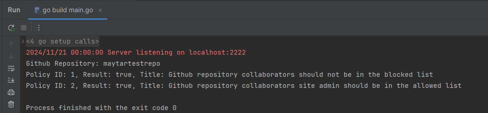

# Github Repositories Evaluator

A gRPC-based backend service for validating policies on GitHub organization repositories.

The service provides one RPC method - GetRepositoriesEvaluation, which receives a GitHub organization name, fetches its repositories details and evaluates them.
Evaluation is done by the OPA engine. Policies are read from the `policies` directory.

A simple client library is also provided.

# Prerequisites
* Go 1.18+ 
* protoc (Protocol Buffers Compiler)
* protoc go plugins (See instructions in https://grpc.io/docs/languages/go/quickstart/)

# Install
* `go mod tidy`

# Usage
* Create a GitHub classic API token 
  * Follow instruction in the following link and check the repo scope access https://docs.github.com/en/authentication/keeping-your-account-and-data-secure/managing-your-personal-access-tokens
* Make sure you have the right permissions to the wanted GitHub organization.
* Run the server:
  * `GITHUB_TOKEN=<token> ADDRESS=<address> go run githubFetcher/server/cmd/main.go`
* Run the client:
  * `ADDRESS=<address> go run githubFetcher/client/cmd/main.go --organization <organization>`

### Output For Example


# Policies
The policies are located under the `policies` directory.
Each policy has its own directory with its ID as the directory name.
Each directory contains:
- **policy.rego** - the rego code that will be run
- **metadata.json** - the policy's metadata such as ID and title
- **fail.json** - an example for an input for the rego that will fail
- **pass.json** - an example for an input for the rego that will pass
### Current Policies
1. GitHub repository collaborators should not be in the blocked list
2. GitHub repository collaborators site-admin should be in the allowed list

# Server Accepted Environment Variable
* **GITHUB_TOKEN** - the token used for GitHub api requests
* **ADDRESS** - the address the server will listen on, default is localhost:9900

### .env example
```
GITHUB_TOKEN=ghp_asda123123123
ADDRESS=localhost:8200
```
